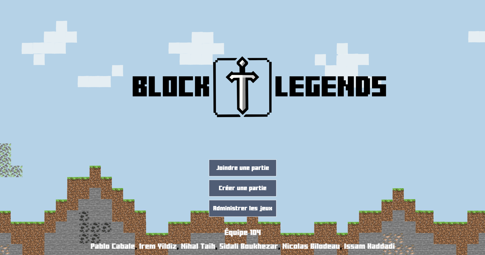
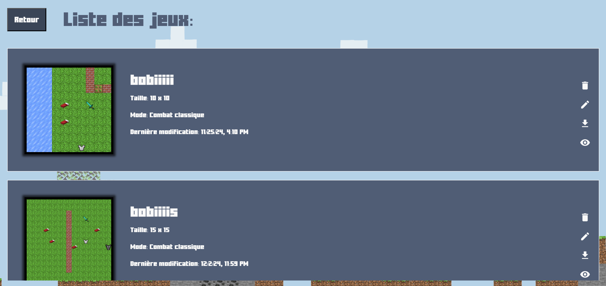
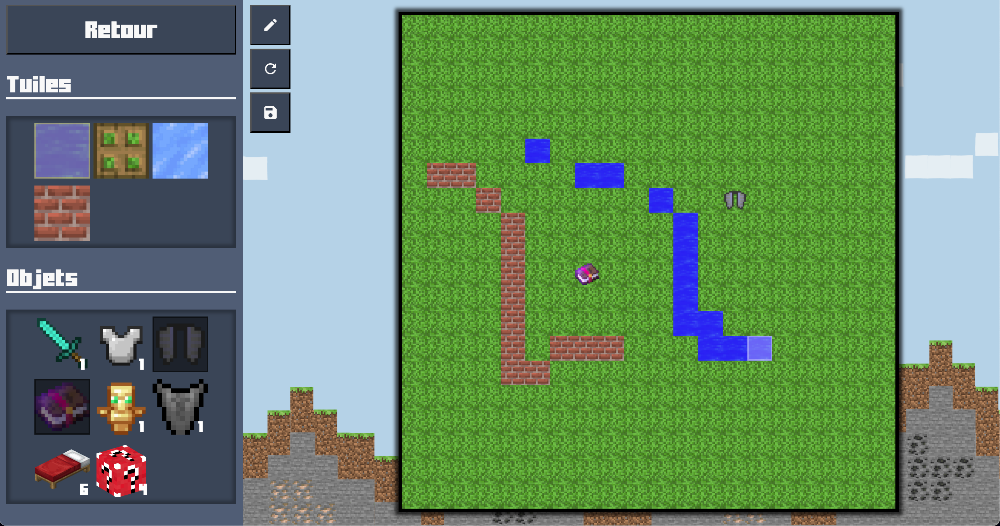
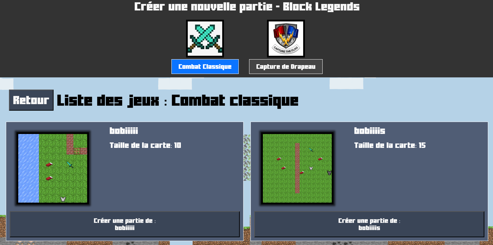
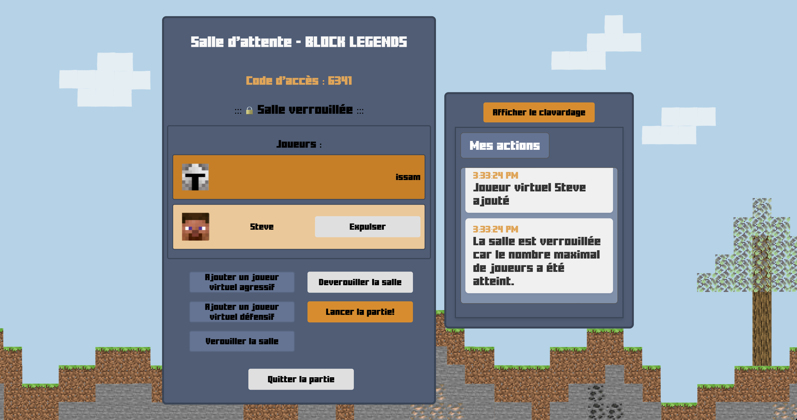
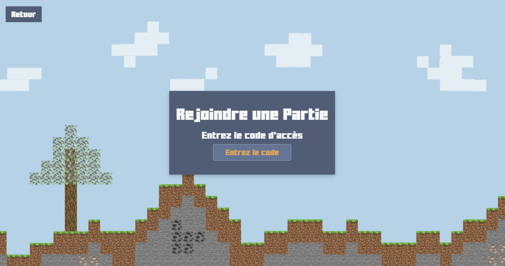
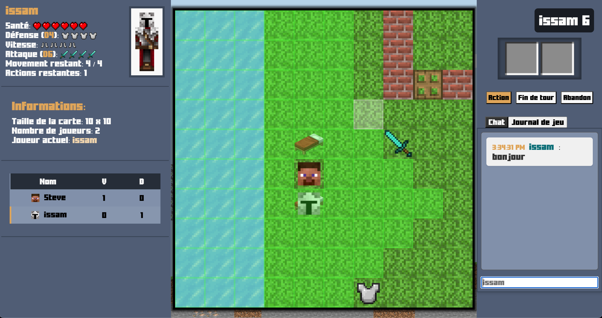
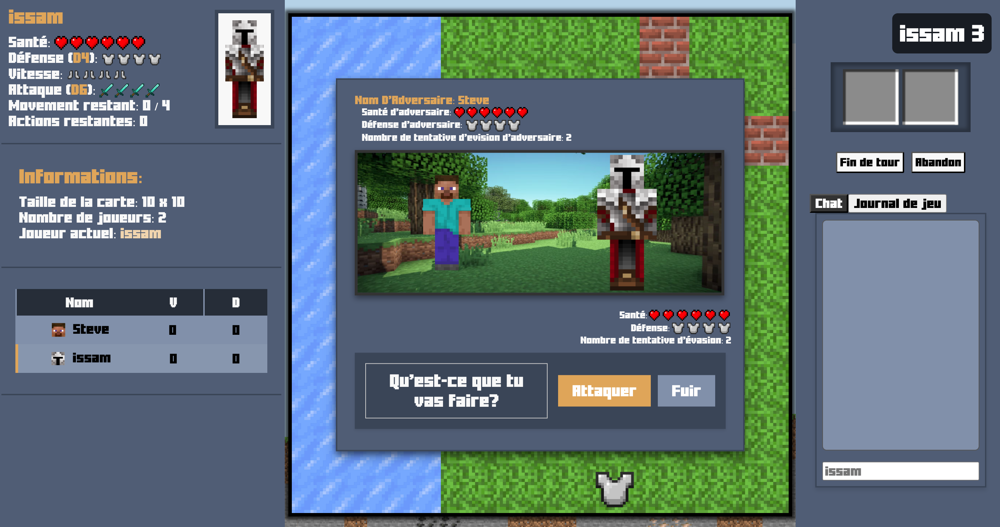

# Plateforme de RPG Tactique

Bienvenue dans la plateforme de jeu de rôle tactique développée dans le cadre du cours-projet **LOG2990**.

## Description Générale

Ce projet consiste à développer une plateforme minimaliste permettant de jouer à des jeux de rôle tactiques, un peu dans le même style que Dofus.
Le projet permet de jouer en ligne ou seul avec des bots, creer des maps et des parties.

## Fonctionnalités

### Vue Initiale
- Page d'accueil avec le logo du jeu.
- Options :
  - Joindre une partie
  - Créer une partie
  - Administrer les jeux



### Administration des Jeux
- Liste des jeux disponibles avec :
  - Nom, taille de la carte, mode de jeu, aperçu et date de modification.
- Options : Éditer, supprimer, exporter (JSON), ou importer des jeux.



### Création/Édition d'un Jeu
- Configuration initiale :
  - Mode de jeu : Classique ou Capture the Flag.
  - Taille de la carte : Petite (10x10), Moyenne (15x15), ou Grande (20x20).
- Placement interactif de tuiles (mur, porte, eau, glace) et d'objets.
- Validation des configurations avant l'enregistrement.



### Création de partie
- Choix de la map.
- Création du personnage de l'administrateur
- Saisie du code de la salle pour qu'un autre joueur rejoigne.
- Ajout ou non de bots.
- Possibilité de communiquer avec les autres joueurs via le chat de la salle d'attente.





### Joindre une partie
- Saisie du code de la salle pour qu'un autre joueur rejoigne.
- Envoie ensuite vers la salle d'attente associée si le code est correct.



### Déroulement d'une Partie
- Création de personnages : Nom, avatar et attribution des bonus.
- Ordre des tours défini par l'attribut de rapidité.
- Actions par tour :
  - Déplacement, interaction avec l'environnement, ou combat.
- Modes de jeu :
  - **Classique** : Gagner trois combats.
  - **Capture the Flag** : Ramener le drapeau à son point de départ.



### Combat
- Résolution au tour par tour.
- Calculs impliquant des attributs (attaque/défense) et des dés bonus.
- Évasion possible (limité à 2 tentatives par combat).



### Interface Utilisateur
- Informations de la partie : Taille de la carte, joueurs présents, joueur actif.
- Informations personnelles : Points de vie, attributs, inventaire.
- Zone de messages : Chat et journal des événements de jeu.
- Liste des joueurs avec indicateurs pour l'organisateur et les joueurs virtuels.


## Installation

1. Clonez ce dépôt :
   ```bash
   git clone https://github.com/isshadd/Block-Legends.git
   ```

2. Assurez-vous d'avoir les dépendances nécessaires installées (Nest.js) :
   ```bash
   npm ci # ou npm install
   ```

4. Lancez l'application dans les dossier client ET server :
   ```bash
   npm start # ou python app.py
   ```


## Auteurs

- Issam Haddadi, Sidali Boukhezar, Pablo Cabale, Irem Yildiz, Nihal Taih et Nicolas Bilodeau.

## Remerciements

Un merci spécial à tous les contributeurs de l'équipe 104 du cours LOG2990A24 et enseignants ainsi que chargés ayant guidé ce projet.
